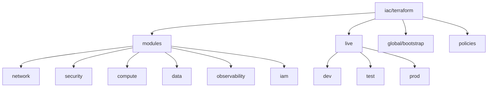

# 02 — Enfoque Terraform (sin HCL)

## Diseño modular
- Módulos por dominio: `network/`, `security/`, `compute/`, `data/`, `observability/`, `iam/` (ver `iac/terraform/modules/`).
- Variables normalizadas (`env`, `region`, `tags`), *defaults* seguros (sin acceso público, cifrado on, retención logs).

## Estado y bloqueo
- Backend S3 cifrado + **lock en DynamoDB** por entorno/cuenta (ver `iac/terraform/global/bootstrap/`).
- Estados **aislados por dominio** para reducir *blast radius*.

## Seguridad IaC (*shift-left*)
- `tflint`, `tfsec/Checkov`, `OPA/Conftest`, `Infracost` en PR.
- **OIDC** GitHub→AWS, sin llaves permanentes; *least privilege* por *job*.

## Reutilización y *drift*
- Versionado semántico de módulos; `plan` programado para detectar *drift* (issue automático).

## Estructura de referencia
- Árbol propuesto y esqueletos en `iac/terraform/`.
- Archivos base documentados en `iac/terraform/base-files.md` (no se incluyen `.tf` activos en este repo).

## Diagrama — Organización IaC

## Sugerencias de configuración
- Backend S3: `bucket = <org>-tfstate`, `key = <stack>/<env>/terraform.tfstate`, `dynamodb_table = <org>-tf-locks`, `encrypt = true`.
- Nombres consistentes: `<org>-<dominio>-<env>-<region>` para recursos y etiquetas `Name`.
- Tags obligatorias: `CostCenter`, `Owner`, `Environment`, `DataClass`, `RTO`, `RPO` (ver `docs/04-governance-and-policies.md`).
- IAM CI/CD: OIDC GitHub→AWS con roles por job (`PlanRole`, `ApplyRole`, `DriftRole`) y sesiones ≤ 1h.
- Retención de logs: 30–90 días en CloudWatch; archivado a S3 con lifecycle a Glacier.
- Lint/Seguridad/Coste: `tflint`, `tfsec/Checkov`, `OPA/Conftest`, `Infracost` como gates en PR.

## Separación de responsabilidades (ejemplo)
- `modules/*`: implementación reusable por dominio.
- `live/*`: composición por entorno (define backend y variables del stack).
- `global/bootstrap`: artefactos únicos (S3/DynamoDB/KMS) para estado remoto.
- `policies/`: reglas conceptuales de cumplimiento (OPA/Conftest) a aplicar en CI.

> Ver `docs/04-governance-and-policies.md` para políticas mínimas.
