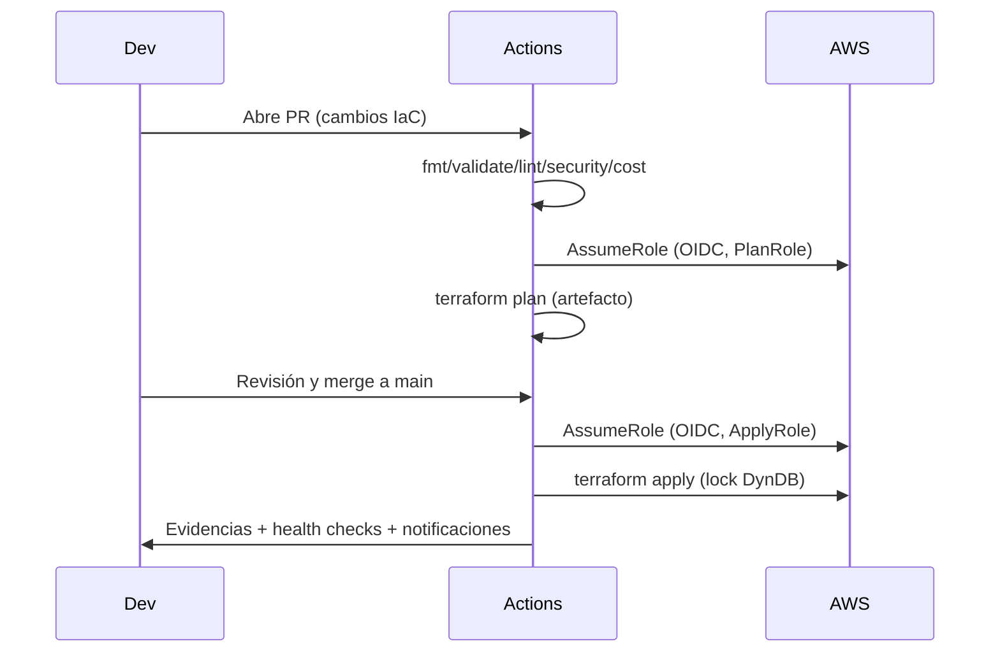

# 03 — CI‑CD con GitHub Actions (sin YAML)

## PR (shift‑left)
- `fmt/validate`, `tflint`, `tfsec/Checkov`, `OPA/Conftest`, `Infracost`.
- `terraform plan` por stack (`/live/dev|test|prod`).
- Publicación de artefactos: planfile firmado + reportes.

## Rama protegida (main/prod)
- Aprobaciones requeridas + *status checks*.
- `apply` solo con **planfile aprobado** (checksum coincide).

## Identidad OIDC y permisos
- Roles por *job*: `PlanRole` (lectura), `ApplyRole` (mutación restringida), `DriftRole` (lectura).
- Sesiones cortas, *boundaries* por repo/branch/entorno.

## Diagrama secuencial

## Drift y rollback
- *Plan* programado; si hay *drift*: issue automático + PR de remediación.
- Rollback = revert del commit + nuevo `plan/apply` controlado.
